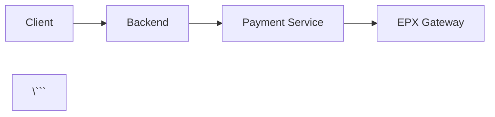

# GitHub Wiki Setup Guide

This guide explains how to publish the consolidated documentation to GitHub Wiki.

---

## Quick Setup

### 1. Enable Wiki

1. Go to your GitHub repository
2. Navigate to **Settings** → **Features**
3. Check **Wikis** to enable

### 2. Clone the Wiki Repository

```bash
# Clone the wiki (replace with your repo)
git clone https://github.com/kevin07696/payment-service.wiki.git
cd payment-service.wiki

# Copy documentation files
cp ../docs/DATAFLOW.md ./
cp ../docs/DEVELOP.md ./
cp ../docs/API_SPECS.md ./
cp ../docs/CICD.md ./
cp ../docs/DATABASE.md ./
cp ../docs/AUTH.md ./

# Rename API_SPECS to avoid underscore issues
mv API_SPECS.md API-Specs.md

# Commit and push
git add .
git commit -m "Add consolidated documentation"
git push origin master
```

### 3. Create Wiki Home Page

Create `Home.md`:

```markdown
# Payment Service Documentation

Welcome to the Payment Service documentation. This service provides multi-tenant payment processing with support for credit cards and ACH payments.

## 📚 Documentation

### Core Guides

- **[Getting Started](DEVELOP)** - Architecture, setup, and development workflow
- **[API Reference](API-Specs)** - Complete API documentation for all services
- **[Authentication](AUTH)** - Token-based auth and authorization

### Payment Flows

- **[Payment Dataflows](DATAFLOW)** - Browser Post, Server Post, ACH flows

### Operations

- **[CI/CD Pipeline](CICD)** - Deployment and secrets management
- **[Database Schema](DATABASE)** - Schema reference and query patterns

## 🚀 Quick Links

- [Create Your First Payment](DATAFLOW#browser-post-flow)
- [Generate Authentication Tokens](AUTH#token-structure)
- [Database Schema Reference](DATABASE#schema-details)
- [Deploy to Staging](CICD#staging-pipeline)

## 🔗 External Resources

- [EPX API Documentation](https://developer.north.com)
- [GitHub Repository](https://github.com/kevin07696/payment-service)

---

**Need help?** Open an issue on [GitHub](https://github.com/kevin07696/payment-service/issues)
```

### 4. Create Sidebar Navigation

Create `_Sidebar.md`:

```markdown
**📚 Documentation**

**Getting Started**
- [Home](Home)
- [Development Guide](DEVELOP)

**Integration**
- [API Reference](API-Specs)
- [Authentication](AUTH)
- [Payment Flows](DATAFLOW)

**Operations**
- [CI/CD Pipeline](CICD)
- [Database Schema](DATABASE)

**Reference**
- [EPX API](https://developer.north.com)

---

**Quick Links**
- [Create Payment](DATAFLOW#browser-post-flow)
- [Token Auth](AUTH#token-structure)
- [Database Tables](DATABASE#table-summary)
```

### 5. Create Footer

Create `_Footer.md`:

```markdown
---
📖 [Documentation Home](Home) | 🐛 [Report Issue](https://github.com/kevin07696/payment-service/issues) | 💬 [Discussions](https://github.com/kevin07696/payment-service/discussions)
```

---

## Automated Sync Script

Save as `scripts/sync-wiki.sh`:

```bash
#!/bin/bash
set -e

WIKI_DIR="../payment-service.wiki"
DOCS_DIR="./docs"

echo "🔄 Syncing documentation to GitHub Wiki..."

# Check if wiki directory exists
if [ ! -d "$WIKI_DIR" ]; then
    echo "❌ Wiki directory not found: $WIKI_DIR"
    echo "Clone the wiki first:"
    echo "  git clone https://github.com/kevin07696/payment-service.wiki.git $WIKI_DIR"
    exit 1
fi

# Copy documentation files
echo "📋 Copying documentation files..."
cp "$DOCS_DIR/DATAFLOW.md" "$WIKI_DIR/"
cp "$DOCS_DIR/DEVELOP.md" "$WIKI_DIR/"
cp "$DOCS_DIR/API_SPECS.md" "$WIKI_DIR/API-Specs.md"  # Rename for wiki
cp "$DOCS_DIR/CICD.md" "$WIKI_DIR/"
cp "$DOCS_DIR/DATABASE.md" "$WIKI_DIR/"
cp "$DOCS_DIR/AUTH.md" "$WIKI_DIR/"

# Navigate to wiki directory
cd "$WIKI_DIR"

# Check for changes
if [ -z "$(git status --porcelain)" ]; then
    echo "✅ No changes to sync"
    exit 0
fi

# Commit and push
echo "📤 Pushing changes to wiki..."
git add .
git commit -m "docs: Sync documentation from main repo ($(date +%Y-%m-%d))"
git push origin master

echo "✅ Documentation synced successfully!"
echo "🌐 View at: https://github.com/kevin07696/payment-service/wiki"
```

Make it executable:

```bash
chmod +x scripts/sync-wiki.sh
```

Run it:

```bash
./scripts/sync-wiki.sh
```

---

## Wiki File Naming Conventions

GitHub Wiki has specific naming rules:

| Source File | Wiki File | Wiki URL |
|------------|-----------|----------|
| `DATAFLOW.md` | `DATAFLOW.md` | `/wiki/DATAFLOW` |
| `API_SPECS.md` | `API-Specs.md` | `/wiki/API-Specs` |
| `CICD.md` | `CICD.md` | `/wiki/CICD` |
| `DATABASE.md` | `DATABASE.md` | `/wiki/DATABASE` |

**Rules:**
- No underscores (use hyphens instead)
- Spaces become hyphens
- Case-sensitive on links

---

## Linking Between Pages

### Internal Links

```markdown
<!-- Link to another wiki page -->
[Authentication Guide](AUTH)

<!-- Link to specific section -->
[Browser Post Flow](DATAFLOW#browser-post-flow)

<!-- Link with custom text -->
See the [database schema](DATABASE#merchants) for details.
```

### External Links

```markdown
<!-- Link to main repo -->
[View Source Code](https://github.com/kevin07696/payment-service)

<!-- Link to issues -->
[Report Bug](https://github.com/kevin07696/payment-service/issues)
```

---

## Advanced Features

### Table of Contents

Add to each page:

```markdown
## Table of Contents

- [Overview](#overview)
- [Quick Start](#quick-start)
- [API Reference](#api-reference)
```

### Code Syntax Highlighting

```markdown
```go
func main() {
    fmt.Println("Hello, World!")
}
\```

```typescript
const token = jwt.sign({ sub: 'user_123' }, SECRET);
\```
```

### Mermaid Diagrams

```markdown


### Alerts/Callouts

```markdown
> **⚠️ Warning:** Never store credit card numbers in the database.

> **💡 Tip:** Use idempotency keys for all payment operations.

> **✅ Success:** Transaction approved with auth_resp = "00"
```

---

## Continuous Integration

### GitHub Actions Workflow

Create `.github/workflows/sync-wiki.yml`:

```yaml
name: Sync Wiki

on:
  push:
    branches: [main]
    paths:
      - 'docs/DATAFLOW.md'
      - 'docs/DEVELOP.md'
      - 'docs/API_SPECS.md'
      - 'docs/CICD.md'
      - 'docs/DATABASE.md'
      - 'docs/AUTH.md'

jobs:
  sync:
    runs-on: ubuntu-latest
    steps:
      - name: Checkout main repo
        uses: actions/checkout@v4

      - name: Checkout wiki
        uses: actions/checkout@v4
        with:
          repository: ${{ github.repository }}.wiki
          path: wiki

      - name: Copy documentation files
        run: |
          cp docs/DATAFLOW.md wiki/
          cp docs/DEVELOP.md wiki/
          cp docs/API_SPECS.md wiki/API-Specs.md
          cp docs/CICD.md wiki/
          cp docs/DATABASE.md wiki/
          cp docs/AUTH.md wiki/

      - name: Push to wiki
        run: |
          cd wiki
          git config user.name "github-actions[bot]"
          git config user.email "github-actions[bot]@users.noreply.github.com"
          git add .
          git diff-index --quiet HEAD || git commit -m "docs: Auto-sync from main repo"
          git push
```

---

## Best Practices

### 1. Keep Main Repo as Source of Truth

```bash
# Always edit in main repo
vim docs/DATAFLOW.md

# Then sync to wiki
./scripts/sync-wiki.sh
```

### 2. Version Documentation

Add version badges to Home.md:

```markdown


```

### 3. Search Optimization

Add keywords to each page:

```markdown
---
Keywords: payment, api, rest, grpc, credit card, ach
---
```

### 4. Analytics

Add to `_Footer.md`:

```markdown
<!-- Google Analytics (optional) -->

```

---

## Troubleshooting

### Issue: Changes Not Appearing

```bash
# Clear browser cache or use incognito mode
# GitHub Wiki can cache for up to 5 minutes
```

### Issue: Images Not Loading

```bash
# Upload images to wiki or use absolute URLs
git clone https://github.com/kevin07696/payment-service.wiki.git
cd payment-service.wiki
mkdir images
cp ../docs/images/* images/
git add images/
git commit -m "Add images"
git push
```

Then reference:

```markdown

```

### Issue: Links Breaking

```bash
# Use wiki-style links (no .md extension)
[Link to AUTH](AUTH)  # ✅ Correct
[Link to AUTH](AUTH.md)  # ❌ Wrong
```

---

## Wiki URL Structure

Your wiki will be available at:

```
https://github.com/kevin07696/payment-service/wiki

Pages:
https://github.com/kevin07696/payment-service/wiki/Home
https://github.com/kevin07696/payment-service/wiki/DATAFLOW
https://github.com/kevin07696/payment-service/wiki/DEVELOP
https://github.com/kevin07696/payment-service/wiki/API-Specs
https://github.com/kevin07696/payment-service/wiki/CICD
https://github.com/kevin07696/payment-service/wiki/DATABASE
https://github.com/kevin07696/payment-service/wiki/AUTH
```

---

## Alternative: GitHub Pages

If you prefer GitHub Pages instead of Wiki:

```bash
# Enable GitHub Pages
# Settings → Pages → Source: main branch /docs folder

# Add _config.yml to docs/
cat > docs/_config.yml << 'EOF'
theme: jekyll-theme-cayman
title: Payment Service Documentation
description: Multi-tenant payment processing API
EOF

# Access at: https://kevin07696.github.io/payment-service/
```

---

## Summary

**Recommended Setup:**
1. ✅ Clone wiki repo
2. ✅ Create `Home.md` and `_Sidebar.md`
3. ✅ Copy 6 documentation files
4. ✅ Rename `API_SPECS.md` → `API-Specs.md`
5. ✅ Set up sync script
6. ✅ Add GitHub Actions workflow (optional)

**Result:** Professional documentation site with sidebar navigation and automatic syncing from your main repository.